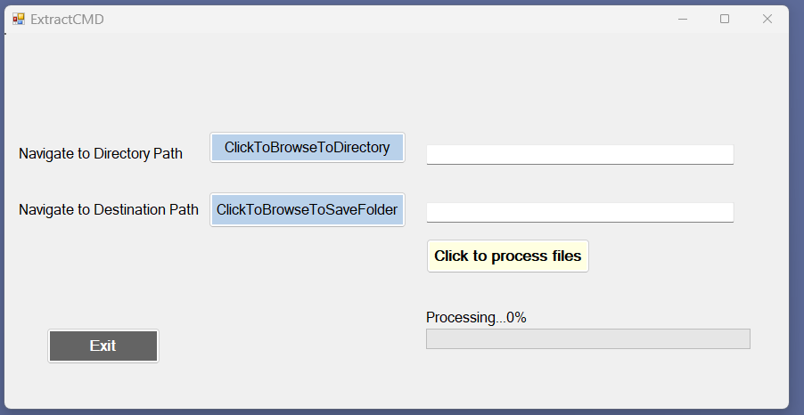
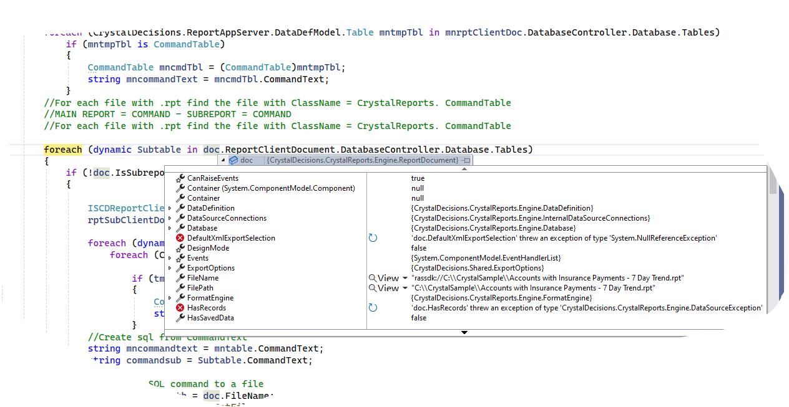

# Extract-COMMAND-from-Crystal-Report-Csharp

Extract the COMMAND SQL code from a list of SAP Crystal Reports and save the code to a .sql file.

## The Repository

This repository is a C# project created to extract the COMMAND SQL Object from a SAP Crystal Report. The SQL is extracted and saved to a .sql file which can then be scanned for table and column names which have been deprecated or changed due to software upgrades.

## Screenshots

## Technologies

The code is written with:

- C#
- Visual Studio with SAP Crystal Reports, developer version for Microsoft Visual Studio
